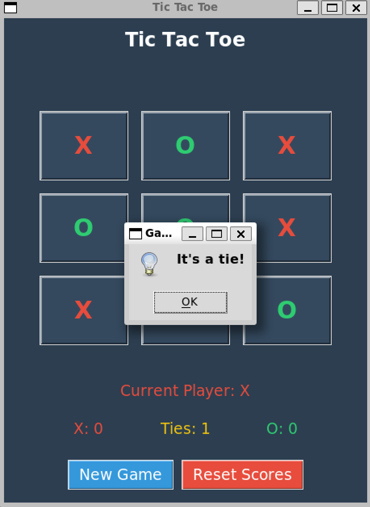

# Tic-Tac-Toe Game

This repository contains my implementation of the **Tic-Tac-Toe** game using **Python** and **Prover9**, a resolution-based automated theorem prover. The game is designed to not only follow the traditional rules of Tic-Tac-Toe but also incorporates Prover9 logic to validate moves, check for winners, and enhance the overall game experience.

## Project Overview

**Tic-Tac-Toe** is a two-player game played on a **3x3 grid** where each player takes turns marking their chosen symbol ('X' or 'O'). The game ends when one player aligns three marks in a row, either horizontally, vertically, or diagonally, or when the board is full and no one wins.

This project integrates **Prover9**, a tool for automated reasoning, to validate the moves made by the players and ensure the game logic follows all the necessary rules. Prover9 is used for:

- **Game State Validation:** Ensuring that the moves made by players are logically valid.
- **Move Generation and Evaluation:** Computing the best possible moves or suggesting moves for the AI (if implemented).
- **Winner Detection:** Using propositional logic to determine if a player has won the game.

